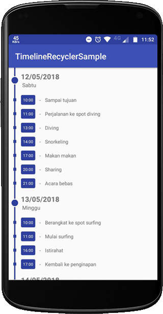

# TimelineRecyclerSample
Just a sample project to create timeline view from default RecyclerView.
Just tweak getItemViewType from RecyclerView adapter. Tweak inspired by [tim.paetz](https://github.com/paetztm) code

Sample app : load itinerary data



# Note
``` List<Object> ``` must be sort and group first
